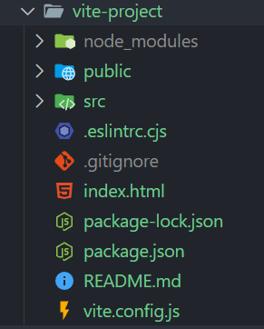
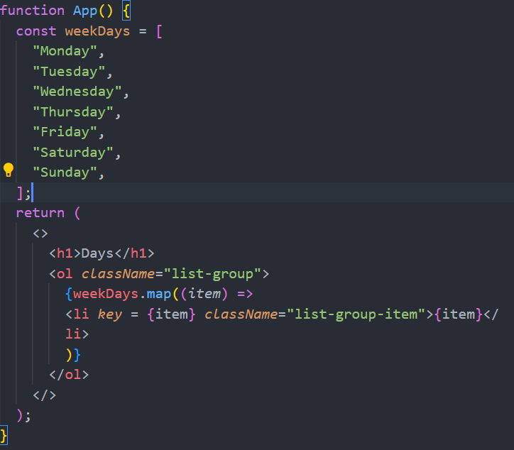

# React Notes

## 1. What is React?

1. `Javascript` library to build `Dynamic` and `interactive` user Interface.
2. Developed at `Facebook` in `2011`.
3. Currently most widely used `JS library` for front-end development.
4. Used to create SPA `(Single Page Application)`.

## 2. Working of DOM

1. Browser takes `HTML` and create `DOM`.
2. JS help us modify `DOM` based on `user actions` or `events`.
3. In `Big applications`,working with `DOM` becomes complicated.

## 3. Problems with Javascript

1. React has a `simpler mental model`.
2. JS is `cumbersome`.
3. JS is `error-prone`.
4. JS is `Hard to maintain`.

## 4. Working of React

1. No need to worry about `querying` and `updating DOM`.
2. React creates a web page with `small` and `reusable componets`.
3. React will take care of `creating` and `updating DOM` elements.
4. It saves a lot of time, `cheezein aasan hai,pahele se Likhi hue hai`.

## 5. `React` vs `Javascript`

1. React is a `library` while JS is a `language`.
2. `Js is imperative` : You define steps to reach your desired state.
3. `React is Declarative` : You define the target UI state and then react figure out how to react that state.

## 6. Introduction to Components

1. Components help us write reusable,modules and better orginazation.
2. Components are like `lego blocks` that can be reused to build different UI's.

# Chapter 01

## 7. What is IDE?

1. IDE stands for `(Integrated Development Environment)`
2. `Visual Studio Code` is a popular IDE for React development.
3. `IntelliJ IDEA` is another popular IDE for React development.
4. Software suite that consolidates basic tools required for `software development`.
5. Provides an interface for writing, debugging, and testing software.
6. Central hub for `coding`,finding problems and testing.
7. Designed to improve `developer efficiency`.

## 8. Create a React App

1. Official tool is `CRA(Create React App)`.
2. Vite is a `modern tool` to create React Project.
3. Vite produces `Quick and Small bundle size`.
4. Vite: Use `npm run dev` to launch dev server.
5. Use `npm start` for CRA.

## 9. Project Structures



# Chapter 02

## Create React Components


## 10. File Expansions

1. `.js` : `JavaScript file`.

   - Contains `regular JS` code.
   - Used for `general logic` and components.

2. `.jsx` :` JavaScript XML file`.
   - Combines `Js with HTML-like tages`.
   - Makes it easier to design `UI components.`

## 11. `Class` vs `Functional Components`

### Class Components

- `Stateful` : Can Manage state.
- `Lifecylce` : Access to lifecycle method.
- `Verboss` : More boilerplate code.
- Not perferred anymore.

### Functional Components

- Initially `stateless`.
- `Can use Hooks` for state and efforts.
- `Simpler and more concise`.
- More Popular.

## 12. What is JSX ?

1.  `Definition` : JSX determines how the UI will look wherever the components is used.
2.  `Not HTML` : Though it resembles HTML,you're actually writing JSX,which stands for for JS XML.
3.  `Conversion` : JSX gets converted to regular Javascript.
4.  `Babeljs.io/repl` is a tool that allow you to see how JSX is transformed into javascript.

## 13. Exporting Components

1. `Enables` : the use of a components in other parts.
2. `Default Export`: Allows exporting a single components as the default from a modular.
3. `Named Export ` : Allows exporting multiple items from a module.
4. `Importing`: To use an exported componemts,you need to import it in the destination file using import syntax.

## 14. Other Important Points

1. `JSX Elements` : JSX elements are the building blocks of React components.
2. `Naming` : Must be caplizated,lowercase for default HTML.
3. `HTML` : Unlike vanilla Js, in React ,you can't directly write HTML,in react, you can enabed HTML - like syntax using JSX.
4. `CSS` : In React,CSS can be directly imported into component files,allowing for modular and component-specific styling.

## 15. Dynamic Components

1. `Dynamic Content`: `JSX allows` the creation of `dynamic` and iteractive UI components.
2. `JS Expressions`: `Using {}`, we can embed any Js expression directly within JSX. This includes variables,functions, and more.

## 16. Reusable Components

1. `Modularity` : Components are modular,allowing for easy reuse across different parts of an application.
2. `Consistency` : Reusing components ensures UI consistency and reduces the changes of discriptiion.
3. `Efficiency` : Reduces development time and effort by `avoiding duplication of code`.
4. `Maintainability` : Changes made to a reused component `reflect everywhere` it's used, simplifying updates and bug fixes.

`Add styling in React `

```
function App()
{
   let Number = Math.random() * 100;

   return(
      <div style={{backgroundColor:"blue"}}>
      Random Number : {Math.round(Number)};
      </div>
   );
}
```

## 17. Including Bootstrap

1. `Responsive`
2. `Components`
3. `Customizable`
4. `Cross-Browser`
5. `Open-Source`

### `Way to connet`

- `Install`
  npm i bootstrap@5.3.3
- `import` : 'bootstrap/dist/css/bootstrap.min.css';

## 18. Fragments

1. `What` : Allows grouping of multiple elements without extra DOM nodes.
2. `Why` ?

- Return multiple elements without a wraping parents.
- Cleaner DOM and consistent styling.

3. `How` : Two Syntaxes:

```
1. <React.Fragment>...</React.Fragment>
2. Short <>...</>
```

## 19. Map Method

1. `Purpose` : Render lists from array dat.
2. `JSX elements` : Tranform array items into JSX.
3. `Inline Rendering` : Directly inside JSX

```
{weekDays.map((item) => 
   <li key = {item} className="list-group-item">{item}</li>
)}
```

4. `Key Prop` : Assign unique key to optimized re-renders.
```
<div key = {item.id} > {item.name} </div>
```


